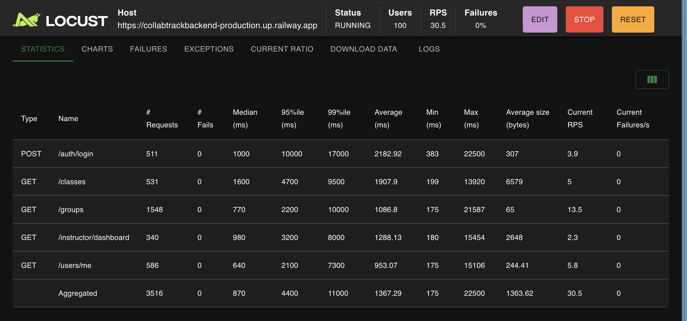
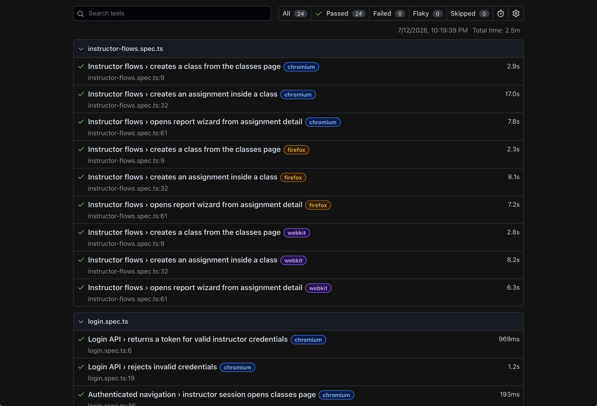
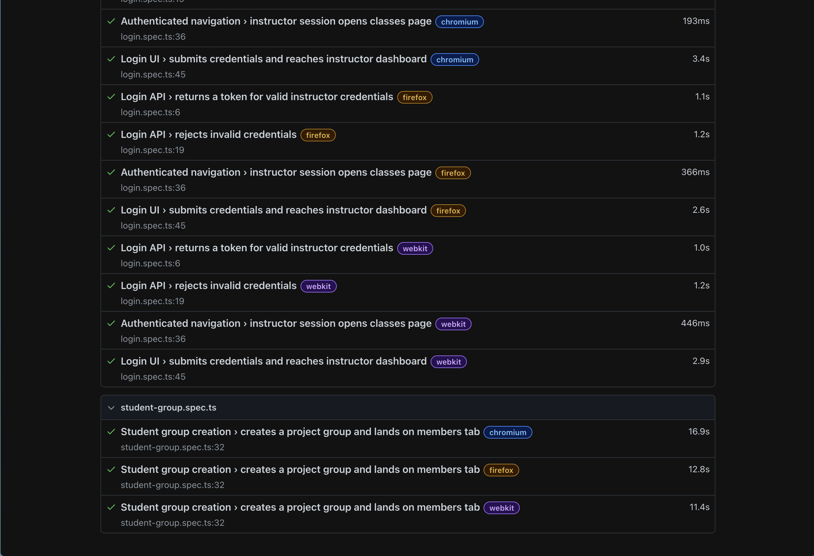
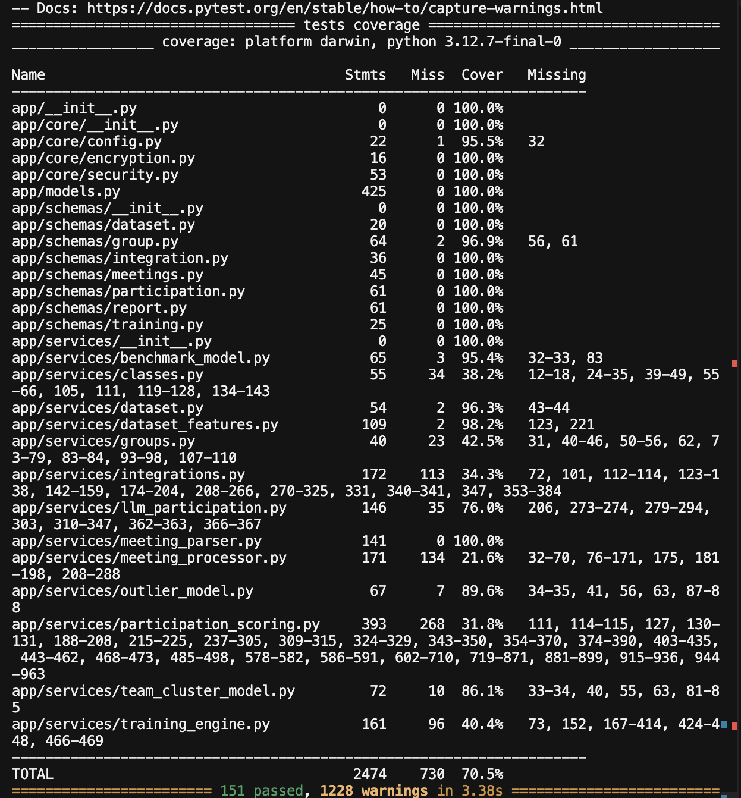

# CollabTrack

**CollabTrack** is a collaboration analytics platform developed at the **African Leadership University (ALU), Kigali campus**. It helps instructors and students see how each member contributes during group assignments by pulling activity from the tools teams already use — **GitHub**, **Google Docs**, and **meeting transcripts/chat** — then turning that activity into per-member contribution scores and explainable reports.

### What CollabTrack does

- **Connects collaboration platforms** — students link GitHub and Google accounts; groups attach repositories and documents to a project.
- **Captures meeting participation** — a Chrome extension exports Google Meet live captions and chat in CollabTrack’s upload format; attendance and speaking/chat counts are parsed from uploaded files.
- **Aggregates multi-platform data** — commits, doc edits, reviews, comments, attendance, speaking turns, and chat messages are synced into one group view.
- **Estimates individual contribution** — a backend ML pipeline (benchmark regression, outlier detection, team clustering, and LLM-generated rationale) produces 0–1 scores and contributor tiers per student.
- **Surfaces results in dashboards** — instructors manage classes, assignments, and contribution reports; students view their group, integrations, and own participation breakdown.

---

## Positioning and Proposal Alignment

**What the platform demonstrates**

- **Literature-informed indicators** — contribution features align with collaborative learning analytics practice: code activity, document edits, review/comment participation, meeting attendance, speaking turns, and chat engagement.
- **Unified multi-platform ingestion** — OAuth-linked **GitHub** and **Google Workspace** APIs plus user-uploaded **meeting transcript/chat** files feed a single backend participation model.
- **End-to-end dashboard workflows** — instructor class/assignment/report flows and student group/integration views on one deployed web app (frontend + backend + PostgreSQL on Railway).
- **ML-based scoring pipeline** — engineered features → benchmark score prediction → contributor tier classification, with optional outlier flags, team archetype labels, and Gemini-generated reasoning for instructors.
- **Measurable evaluation evidence** — automated tests (pytest edge cases, Playwright E2E across Chromium/Firefox/WebKit, Locust load tests on production) and report-completeness checks (required platforms, parsed meeting files, generated scores).

**What it does not yet fully demonstrate**

- **Fully automatic** Google Meet capture — the extension assists export, but students still upload files manually in the report wizard.
- **Campus-wide Moodle/LTI rollout** — Moodle sync exists as integration groundwork but is not the primary evaluated deployment path in scope.

---

# CollabTrack Frontend

This repository is the **Next.js frontend** for that system. The [backend API](https://github.com/yvettegahamanyi/collabtrack_backend), and [Chrome extension](https://github.com/yvettegahamanyi/collabtrack_extension) complete the full CollabTrack stack.

<!-- , and [Colab team classification notebook](https://colab.research.google.com/drive/1x8Tya-B6-TqggDVnVJf2u85wK_biDo7Z?usp=sharing)  -->

<!-- **Colab notebook:** [Scoring Modal Notebook](https://colab.research.google.com/drive/1x8Tya-B6-TqggDVnVJf2u85wK_biDo7Z?usp=sharing) -->

**Backend repository:** [collabtrack_backend](https://github.com/yvettegahamanyi/collabtrack_backend)

**Extension repository:** [extension](https://github.com/yvettegahamanyi/collabtrack_extension)

**Designs:** [CollabTrack on Figma](https://www.figma.com/design/8ABtyvdgwjShvJcZnGHaVw/CollabTrack?node-id=0-1&t=FrTbk1dqAEqgkY1S-1)

**Demo video:** [Google Drive Video](https://drive.google.com/file/d/1nwUcfmIy3uYQi1J63FmgSh3CYJzZ6ecP/view?usp=sharing)

---

## Deployment

The frontend, backend, and database are deployed on **[Railway](https://railway.app)**.

| Service                   | Hosted URL                                                |
| ------------------------- | --------------------------------------------------------- |
| Frontend                  | https://collabtrackfrontend-production.up.railway.app     |
| Backend API documentation | https://collabtrackbackend-production.up.railway.app/docs |

---

## Tech stack

- **Framework:** [Next.js](https://nextjs.org) 16 (App Router)
- **Language:** TypeScript
- **Styling:** Tailwind CSS 4, shadcn/ui
- **Data fetching:** TanStack Query
- **State:** Zustand (auth)
- **HTTP client:** Axios
- **Forms & validation:** React Hook Form, Zod

---

## Project structure

```
collabtrack-frontend/
├── app/                          # Next.js App Router pages
│   ├── admin/                    # Admin dashboard
│   ├── instructor/               # Instructor routes (groups, settings)
│   ├── student/                  # Student routes (groups, settings)
│   ├── invite/[token]/           # Group invite acceptance
│   ├── login/                    # Login
│   ├── register/                 # Registration
│   ├── onboarding/               # Role selection after signup
│   ├── layout.tsx                # Root layout
│   └── page.tsx                  # Landing page
├── components/
│   ├── auth/                     # Auth layout wrappers
│   ├── brand/                    # Logo and branding
│   ├── groups/                   # Group list, detail tabs, integrations UI
│   ├── layout/                   # Dashboard shell, headers, user menu
│   ├── providers/                # Theme, React Query providers
│   ├── settings/                 # Settings and integrations cards
│   └── ui/                       # shadcn/ui primitives
├── docs/
│   └── integrations-backend.md   # Backend API contract for GitHub/Google integrations
├── hooks/                        # Legacy/shared hooks
├── lib/
│   ├── api-client.ts             # Axios instance and API helpers
│   ├── auth.ts                   # Auth mapping utilities
│   ├── constants.ts              # Routes, roles, app constants
│   ├── navigation.ts             # Role-aware navigation helpers
│   └── query-keys.ts             # TanStack Query cache keys
├── service/                      # API services and React Query hooks
│   ├── auth.service.ts
│   ├── groups.service.ts
│   ├── integrations.service.ts
│   ├── participation.service.ts
│   ├── use-auth.ts
│   ├── use-groups.ts
│   ├── use-integrations.ts
│   └── use-participation.ts
├── stores/
│   ├── auth-store.ts             # Auth token and user session
│   └── ui-store.ts               # UI state
└── types/                        # Shared TypeScript types
```

### Key routes

| Route                      | Description                                                 |
| -------------------------- | ----------------------------------------------------------- |
| `/login`, `/register`      | Authentication                                              |
| `/onboarding`              | Role selection (student / instructor)                       |
| `/student/group`           | Student group list                                          |
| `/student/group/[groupId]` | Group detail (overview, members, contribution, transcripts) |
| `/student/settings`        | Account settings and GitHub/Google integrations             |
| `/instructor/group`        | Instructor group list (read-only)                           |
| `/instructor/settings`     | Instructor account settings                                 |
| `/invite/[token]`          | Accept a group invitation                                   |

---

## Environment setup

### Prerequisites

- **Node.js** 20+
- **pnpm** (recommended) or npm
- Running [CollabTrack backend](https://github.com/yvettegahamanyi/collabtrack_backend/tree/main) (local or deployed)

### Environment variables

Create a `.env` file in the project root:

```env
NEXT_PUBLIC_API_URL=https://collabtrackfrontend-production.up.railway.app
```

| Variable              | Description                      |
| --------------------- | -------------------------------- |
| `NEXT_PUBLIC_API_URL` | Base URL for the CollabTrack API |

---

## Getting started

Install dependencies:

```bash
pnpm install
```

Run the development server:

```bash
pnpm dev
```

Open [http://localhost:3000](http://localhost:3000) in your browser.

### Scripts

| Command                  | Description                             |
| ------------------------ | --------------------------------------- |
| `pnpm dev`               | Start development server                |
| `pnpm build`             | Production build                        |
| `pnpm start`             | Start production server                 |
| `pnpm lint`              | Run ESLint                              |
| `pnpm test:e2e`          | Run Playwright E2E tests (all browsers) |
| `pnpm test:e2e:chromium` | Run E2E tests in Chromium only          |

---

## Testing

CollabTrack is tested with **Playwright** (E2E, cross-browser), **pytest** (backend unit & edge cases), and **Locust** (load/performance on production). This covers different inputs, edge cases, and performance across software environments.

### Load testing (Locust — production Railway API)



### E2E testing (Playwright — Chromium, Firefox, WebKit)





### Backend testing (pytest — macOS, Python 3.12.7)



---
