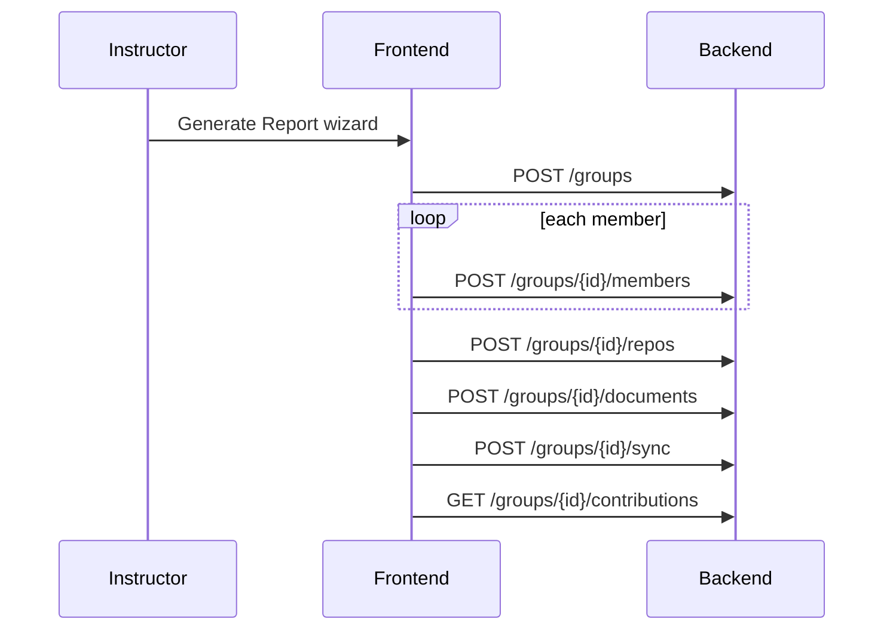

# CollabTrack — Backend Guide: Generate Contribution Report for New Group

This document describes how to implement the **instructor "Generate Report for New Group"** feature on the **CollabTrack FastAPI backend** (`collabtrack_backend`). The frontend wizard in this repo is already wired to the API contract below.

**Related frontend files:**
- `components/groups/generate-contribution-report-dialog.tsx` — 3-step wizard
- `components/groups/contribution-report-page.tsx` — instructor page
- `service/groups.service.ts` — `addGroupMember()`
- `service/participation.service.ts` — link repo/doc, sync, contributions
- `docs/integrations-backend.md` — GitHub/Google integrations contract

**Backend repository:** [collabtrack_backend](https://github.com/yvettegahamanyi/collabtrack_backend)

---

## Overview

Instructors can generate contribution reports for groups even when students are **not yet registered** on CollabTrack. When an instructor adds a member by name and email:

| Case | Backend behavior |
|------|------------------|
| Email already exists | Attach that user to the group as `STUDENT` |
| Email not registered | Auto-register a student with `name`, `email`, hashed default password, `account_status = PENDING`, `has_logged_in = false` |
| Email belongs to non-student | Return `409` (do not add admin/instructor as roster member) |

Pending users appear in contribution reports before first login. Metrics are attributed from GitHub/Google activity matched by member email (see Sync section).

---

## Frontend call sequence

The wizard submits **5 sequential API calls** (no frontend change required if backend implements these correctly):



All responses use the existing envelope:

```json
{
  "data": { ... },
  "message": "Operation completed successfully.",
  "code": 200
}
```

Base URL: `http://localhost:8000/api` (or `NEXT_PUBLIC_API_URL` in frontend `.env`).

---

## API contract

### 1. Create group (existing — ensure instructors can call it)

```http
POST /api/groups
Authorization: Bearer {instructor_jwt}
Content-Type: application/json
```

**Request:**

```json
{
  "group_name": "CS Capstone Team B",
  "description": "optional",
  "assignment_status": "ACTIVE"
}
```

**Backend must:**
- Allow `INSTRUCTOR` role to create groups
- Set `owner_id = current_user.id`
- Insert creator into `group_members` as `INSTRUCTOR`, `is_owner = true`

**Response `data`:** Group object (see frontend `types/groups.ts`).

---

### 2. Add group member (NEW — required for this feature)

```http
POST /api/groups/{group_id}/members
Authorization: Bearer {instructor_jwt}
Content-Type: application/json
```

**Request:**

```json
{
  "name": "Jane Doe",
  "email": "jane@university.edu"
}
```

**Validation:**
- `name`: min 1, max 120 characters
- `email`: valid email, normalized to lowercase
- Idempotent: if user is already in group → return `200` with current group (no duplicate row)

**Response `data`:** Group object including updated `members[]`.

**Errors:**

| Status | When |
|--------|------|
| 404 | Group not found |
| 403 | Caller not allowed to manage group |
| 409 | Email belongs to a non-student user |
| 422 | Invalid name or email |

**Authorization:**
- Caller must be JWT-authenticated
- Caller must be `INSTRUCTOR` and either group owner, instructor member of the group, or creator of the group

---

### 3. Link GitHub repo (existing)

```http
POST /api/groups/{group_id}/repos
Content-Type: application/json

{ "url": "https://github.com/org-name/capstone-project" }
```

See `docs/integrations-backend.md`.

---

### 4. Link Google Doc (existing)

```http
POST /api/groups/{group_id}/documents
Content-Type: application/json

{ "url": "https://docs.google.com/document/d/1abc.../edit" }
```

See `docs/integrations-backend.md`.

---

### 5. Sync participation (existing)

```http
POST /api/groups/{group_id}/sync
```

**Response:**

```json
{
  "data": {
    "group_id": "uuid",
    "synced_at": "2026-06-13T12:00:00Z",
    "members_synced": 4
  },
  "message": "Group participation data synced.",
  "code": 200
}
```

---

### 6. Get contributions (existing)

```http
GET /api/groups/{group_id}/contributions
```

**Response:**

```json
{
  "data": {
    "group_id": "uuid",
    "last_synced_at": "2026-06-13T12:00:00Z",
    "members": [
      {
        "user_id": "uuid",
        "name": "Jane Doe",
        "email": "jane@university.edu",
        "account_status": "PENDING",
        "github_connected": false,
        "google_connected": false,
        "github_login": null,
        "google_email_matched": null,
        "github": {
          "total_commits": 42,
          "lines_changed": 1500,
          "prs_created": 5,
          "prs_reviewed": 8,
          "comments": 23
        },
        "google_docs": {
          "edits": 67,
          "comments": 14
        }
      }
    ]
  },
  "message": "Contributions retrieved successfully.",
  "code": 200
}
```

`account_status` is optional but recommended (`PENDING` | `ACTIVE`). Set `github` or `google_docs` to `null` when no metrics exist.

---

## Database changes (SQLAlchemy / Alembic)

### Extend `users` table

| Column | Type | Notes |
|--------|------|-------|
| `account_status` | enum | `ACTIVE`, `PENDING` — default `ACTIVE` for normal signups |
| `has_logged_in` | bool | default `false`; set `true` on first successful login |
| `must_change_password` | bool | default `false`; set `true` for auto-provisioned users |
| `provisioned_by_instructor_id` | UUID nullable | audit trail |

### Ensure `group_members` table

| Column | Type |
|--------|------|
| `id` | UUID PK |
| `group_id` | FK → groups |
| `user_id` | FK → users |
| `role` | enum `STUDENT` / `INSTRUCTOR` |
| `is_owner` | bool |
| `joined_at` | timestamptz |

**Unique constraint:** `(group_id, user_id)`.

No separate pending-members table is needed — pending state lives on the user record.

---

## Environment variables

Add to backend `.env`:

```env
DEFAULT_STUDENT_PASSWORD=ChangeMeOnFirstLogin123!
```

- Used only when auto-provisioning students from instructor roster input
- Hash with bcrypt/passlib (same as normal registration)
- Never return this password in API responses

---

## Suggested FastAPI module layout

```
app/
  models/user.py                    # add account_status, has_logged_in, etc.
  models/group_member.py
  schemas/groups.py                 # AddGroupMemberRequest, GroupResponse
  schemas/users.py
  services/user_provisioning.py   # NEW
  services/group_members.py         # NEW
  services/participation_sync.py    # UPDATE attribution logic
  routers/groups.py                 # add POST /{group_id}/members
  routers/auth.py                   # set has_logged_in on login
```

---

## User provisioning service

**File:** `services/user_provisioning.py`

```python
async def get_or_create_student(email: str, name: str, instructor_id: UUID) -> User:
    user = await users_repo.get_by_email(email.lower())
    if user:
        if user.role != Role.STUDENT:
            raise ConflictError("User exists but is not a student")
        return user

    return await users_repo.create(
        email=email.lower(),
        name=name.strip(),
        password_hash=hash_password(settings.DEFAULT_STUDENT_PASSWORD),
        role=Role.STUDENT,
        account_status=AccountStatus.PENDING,
        has_logged_in=False,
        must_change_password=True,
        provisioned_by_instructor_id=instructor_id,
    )
```

### First-login behavior (update `POST /auth/login`)

- On success: set `has_logged_in = True`
- If `must_change_password = True`: either include a flag in the login response or return `403` with a message pointing to a password-change endpoint

---

## Add member endpoint handler

```python
@router.post("/{group_id}/members", response_model=ApiResponse[GroupOut])
async def add_group_member(
    group_id: UUID,
    body: AddGroupMemberRequest,
    current_user: User = Depends(get_current_user),
):
    group = await ensure_instructor_can_manage_group(group_id, current_user)

    student = await user_provisioning.get_or_create_student(
        email=body.email,
        name=body.name,
        instructor_id=current_user.id,
    )

    await group_members_repo.add_if_missing(
        group_id=group.id,
        user_id=student.id,
        role=GroupRole.STUDENT,
    )

    updated = await groups_repo.get_with_members(group.id)
    return success(updated, "Member added successfully.")
```

---

## Sync: email-based attribution for pending students

Auto-provisioned students will not have GitHub/Google OAuth connected. During sync, add **email-based fallback attribution** for members where `github_connected=false` or `google_connected=false`:

### GitHub fallback

- Fetch repo activity using the **instructor's** (or group owner's) connected GitHub token
- For each commit, PR, review, and comment, read author email/login from GitHub API
- Match to `group_members.user.email` (case-insensitive)
- Store raw counts in `participation_snapshots` keyed by `user_id`

### Google Docs fallback

- Use instructor's Google token
- For each revision/comment, match author email to member email
- Store edit/comment counts per `user_id`

When a pending student later connects OAuth and logs in, prefer OAuth-based attribution (`github_login`) over email fallback for that user.

---

## Optional: atomic composite endpoint

To avoid partial failures (group created but members fail), you can add:

```http
POST /api/groups/contribution-reports
Authorization: Bearer {instructor_jwt}
Content-Type: application/json
```

**Request:**

```json
{
  "group_name": "CS Capstone Team B",
  "description": "optional",
  "members": [
    { "name": "Jane Doe", "email": "jane@university.edu" }
  ],
  "github_url": "https://github.com/org/project",
  "google_doc_url": "https://docs.google.com/document/d/..."
}
```

**Single transaction:**

1. Create group
2. Provision and add all members
3. Link repo and doc
4. Run sync
5. Return `{ group, contributions }`

This is **optional**. The current frontend works with the 5 chained calls above. If you add this endpoint, update `generate-contribution-report-dialog.tsx` to call it instead.

---

## Security checklist

- Hash default password; never log or return it
- Rate-limit `POST /groups/{id}/members` (prevent bulk account spam)
- Only instructors can provision students this way
- Force password change on first login for `must_change_password=true`
- Do not expose `provisioned_by_instructor_id` to students
- Validate GitHub/Google URLs before linking
- Verify group membership before returning participation data

---

## Implementation order

1. Alembic migration: user status fields + `group_members` unique constraint
2. `user_provisioning.py` + unit tests
3. `POST /groups/{id}/members` + authorization helper
4. Allow instructor `POST /groups` + owner membership row
5. Expand instructor permissions on repos / documents / sync routes
6. Sync email-fallback attribution for pending members
7. Manual test full wizard against local backend
8. (Optional) composite `POST /groups/contribution-reports`
9. Update `docs/integrations-backend.md` in frontend repo

---

## Manual test plan

1. Login as instructor with GitHub and Google connected in Settings
2. Open `/instructor/contribution-report` → **Generate Report for New Group**
3. Add 2 members: one **existing** student email, one **new** email
4. Submit with GitHub and Google Doc URLs
5. Verify in database:
   - New user row: `account_status=PENDING`, `must_change_password=true`
   - Both users in `group_members`
   - Repo and doc linked
   - `participation_snapshots` rows for both emails after sync
6. Open contribution report → both members listed with metrics
7. Login as auto-provisioned student with default password → forced password change works

---

## Frontend follow-ups (after backend is ready)

| File | Change |
|------|--------|
| `docs/integrations-backend.md` | Cross-link this doc; document `POST /groups/{id}/members` |
| `types/groups.ts` | Optional: `account_status` on `GroupMember` |
| `types/participation.ts` | Optional: `account_status` on `MemberParticipation` |
| `components/groups/group-contribution-tab.tsx` | Optional: "Pending" badge for auto-provisioned students |

No change is required to the wizard flow if the chained endpoints work correctly.
