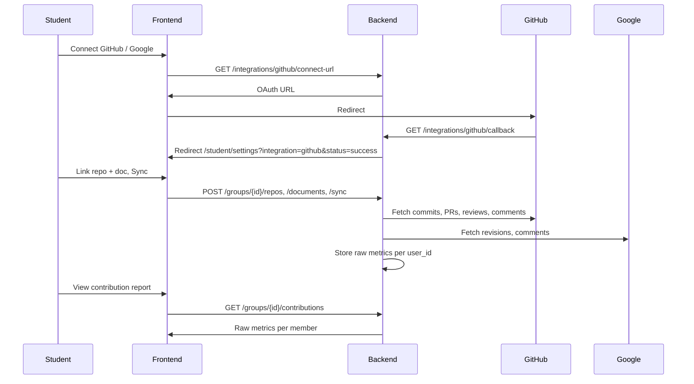

# CollabTrack — Integrations Backend Implementation Guide

This document describes how to implement GitHub and Google Docs integrations on the **CollabTrack backend** (FastAPI). The frontend in this repo is wired to the API contract defined below.

**Related:** Frontend consumes these endpoints from `service/integrations.service.ts`, `service/participation.service.ts`, and extended `service/groups.service.ts`.

---

## Overview

Students connect GitHub and Google Docs in **Settings → Apps & Integrations**, link a **repo** and **Google Doc** to each group, trigger a **sync**, then view **raw participation metrics** in the group Contribution Report and participation modal.



---

## Identity matching

| Source | Identifier | Rule |
|--------|------------|------|
| CollabTrack | `user.id`, `user.email` | Source of truth at signup |
| GitHub | `github_login` (OAuth) | **Use login for all GitHub metrics** — commit emails often differ from signup email |
| Google | OAuth `email`, `sub` | Require OAuth email to match signup email (warn or block on mismatch) |

Never attribute GitHub commits by commit author email alone. Always use the connected `github_login`.

---

## Raw metrics (no scoring formula)

Return **counts only**. Weighted scores and normalization are out of scope.

### GitHub (per user, per linked repo, aggregated per group)

| Field | Description |
|-------|-------------|
| `total_commits` | Commits authored by `github_login` in linked repo(s) |
| `lines_changed` | Sum of `additions + deletions` from commit stats |
| `prs_created` | Pull requests opened by login |
| `prs_reviewed` | PR reviews submitted by login |
| `comments` | Issue + PR + review comments by login |

### Google Docs (per user, per linked doc, aggregated per group)

| Field | Description |
|-------|-------------|
| `edits` | Revision count attributed to Google user |
| `comments` | Drive file comments by user |

**Limitation:** Google does not expose git-style line counts per student. Use revision/edit counts.

---

## Environment variables

```env
GITHUB_CLIENT_ID=
GITHUB_CLIENT_SECRET=
GITHUB_CALLBACK_URL=http://localhost:8000/api/integrations/github/callback

GOOGLE_CLIENT_ID=
GOOGLE_CLIENT_SECRET=
GOOGLE_CALLBACK_URL=http://localhost:8000/api/integrations/google/callback

TOKEN_ENCRYPTION_KEY=
FRONTEND_URL=http://localhost:3000
DATABASE_URL=
```

---

## Database models (suggested)

### `user_integrations`

| Column | Type | Notes |
|--------|------|-------|
| id | UUID | PK |
| user_id | UUID | FK → users |
| provider | enum | `github`, `google` |
| provider_user_id | string | GitHub id / Google sub |
| provider_login | string | GitHub username (nullable for Google) |
| provider_email | string | From OAuth |
| email_matched | boolean | vs CollabTrack signup email |
| access_token_enc | text | Encrypted |
| refresh_token_enc | text | Encrypted, nullable |
| expires_at | timestamptz | nullable |
| connected_at | timestamptz | |
| UNIQUE | | (user_id, provider) |

### `group_github_repos`

| Column | Type |
|--------|------|
| id | UUID |
| group_id | UUID |
| owner | string |
| repo | string |
| default_branch | string, nullable |
| url | string |
| created_at | timestamptz |

### `group_google_docs`

| Column | Type |
|--------|------|
| id | UUID |
| group_id | UUID |
| file_id | string |
| title | string |
| url | string |
| created_at | timestamptz |

### `participation_snapshots`

| Column | Type |
|--------|------|
| id | UUID |
| group_id | UUID |
| user_id | UUID |
| metrics | JSONB | Raw GitHub + Google counts |
| synced_at | timestamptz |

---

## API contract

All responses use the existing envelope:

```json
{
  "data": { ... },
  "message": "Operation completed successfully.",
  "code": 200
}
```

### Integrations

#### `GET /integrations`

```json
{
  "data": {
    "github": {
      "connected": true,
      "login": "yvetteg",
      "email": "student@university.edu",
      "email_matched": true,
      "connected_at": "2026-06-13T10:00:00Z"
    },
    "google": {
      "connected": false,
      "email": null,
      "email_matched": null,
      "connected_at": null
    }
  },
  "message": "Integration status retrieved successfully.",
  "code": 200
}
```

#### `GET /integrations/github/connect-url`

```json
{
  "data": { "url": "https://github.com/login/oauth/authorize?client_id=..." },
  "message": "Connect URL generated.",
  "code": 200
}
```

**GitHub scopes:** `read:user`, `user:email`, `repo` (or `public_repo`)

#### `GET /integrations/github/callback`

Exchange code, store tokens, redirect to:

`{FRONTEND_URL}/student/settings?integration=github&status=success`

#### `DELETE /integrations/github`

#### `GET /integrations/google/connect-url`

**Google scopes:** `openid`, `email`, `profile`, `drive.readonly`, `documents.readonly`

Use `access_type=offline` and `prompt=consent` for refresh token.

#### `GET /integrations/google/callback`

Redirect: `?integration=google&status=success`

#### `DELETE /integrations/google`

---

### Group resources

Group **owner** may link/unlink (adjust policy as needed).

#### `GET /groups/{group_id}/repos`

#### `POST /groups/{group_id}/repos`

```json
{ "url": "https://github.com/org-name/capstone-project" }
```

#### `DELETE /groups/{group_id}/repos/{repo_id}`

#### `GET /groups/{group_id}/documents`

#### `POST /groups/{group_id}/documents`

```json
{ "url": "https://docs.google.com/document/d/1abc.../edit" }
```

#### `DELETE /groups/{group_id}/documents/{doc_id}`

---

### Sync and participation

#### `POST /groups/{group_id}/sync`

```json
{
  "data": {
    "group_id": "uuid",
    "synced_at": "2026-06-13T12:00:00Z",
    "members_synced": 4
  },
  "message": "Group participation data synced.",
  "code": 200
}
```

#### `GET /groups/{group_id}/contributions`

```json
{
  "data": {
    "group_id": "uuid",
    "last_synced_at": "2026-06-13T12:00:00Z",
    "members": [
      {
        "user_id": "uuid",
        "name": "Jane Doe",
        "email": "jane@university.edu",
        "github_connected": true,
        "google_connected": true,
        "github_login": "janedoe",
        "google_email_matched": true,
        "github": {
          "total_commits": 42,
          "lines_changed": 1500,
          "prs_created": 5,
          "prs_reviewed": 8,
          "comments": 23
        },
        "google_docs": {
          "edits": 67,
          "comments": 14
        }
      }
    ]
  },
  "message": "Contributions retrieved successfully.",
  "code": 200
}
```

Set `github` or `google_docs` to `null` when not connected.

#### `GET /groups/{group_id}/members/{user_id}/participation`

Same shape as one `members[]` item (participation modal).

---

## GitHub sync notes

1. Commits: `GET /repos/{owner}/{repo}/commits?author={login}&since={iso_date}`
2. Lines: `GET /repos/{owner}/{repo}/commits/{sha}` → sum `stats`
3. PRs, reviews, comments: filter by author login
4. Use background jobs + cache; respect rate limits

## Google sync notes

1. Parse Doc URL → `file_id`
2. Revisions: Drive API v3
3. Comments: Drive API v3
4. Refresh tokens before batch sync

---

## Security checklist

- Encrypt OAuth tokens at rest
- Never expose provider tokens to frontend
- Validate JWT on all routes
- Verify group membership before returning participation data
- Rate-limit sync endpoint

---

## Implementation order

1. `user_integrations` + encryption
2. GitHub OAuth + `GET /integrations`
3. Google OAuth
4. Group repos/docs endpoints
5. Sync jobs (GitHub + Google)
6. Contributions + participation endpoints

---

## Out of scope

- Weighted participation score formulas
- Transcript metrics
- Profile picture / password change
