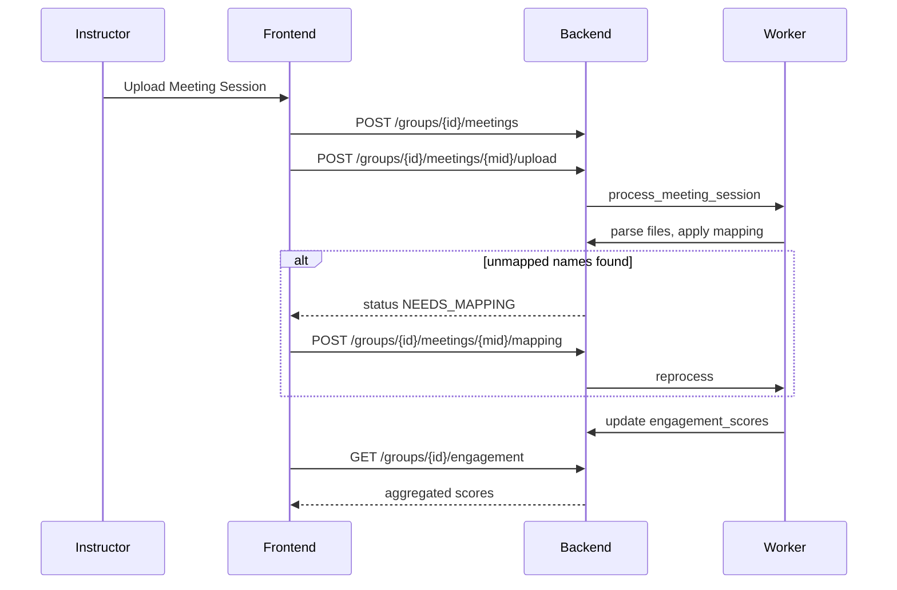

# CollabTrack — Backend Guide: Meeting Engagement Analysis

This document describes how to implement **group meeting engagement analysis** on the **CollabTrack FastAPI backend** (`collabtrack_backend`), based on [`meeting_engagement_feature.md`](../meeting_engagement_feature.md).

**Related docs:**
- [`docs/railway-bucket-storage-backend.md`](railway-bucket-storage-backend.md) — Railway Object Storage (S3) for meeting file uploads
- [`docs/integrations-backend.md`](integrations-backend.md) — GitHub/Google participation contract

**Related frontend:**
- `components/groups/group-meeting-sessions-tab.tsx` — Meeting Sessions tab UI
- `components/groups/group-contribution-tab.tsx` — may surface aggregated engagement metrics
- `service/meetings.service.ts` — multipart upload contract

**Backend repository:** [collabtrack_backend](https://github.com/yvettegahamanyi/collabtrack_backend)

---

## Overview

For each group meeting session, the **instructor or group owner** uploads three files:

| File | Format | Metrics derived |
|------|--------|-----------------|
| Attendance list | `.csv` | `attendance_ratio`, `meeting_lead_count` |
| Meeting transcript | `.txt` | `speaking_ratio` |
| Chat export | `.txt` | `chat_participation` |

After upload, the backend parses files in a **background task**, applies optional **name-to-member mapping**, stores raw per-session metrics, and **recalculates aggregated engagement scores** per student for the group.



All responses use the existing API envelope:

```json
{
  "data": { ... },
  "message": "Operation completed successfully.",
  "code": 200
}
```

Base URL: `http://localhost:8000/api`

---

## Authorization

Only **group owner** or **instructor** group members may:
- Create meeting sessions
- Upload files
- Submit name mappings
- Delete sessions

All group members (including students) may **read** session list and engagement scores for groups they belong to.

---

## Expected file formats

### Attendance CSV

Required columns: `Student_ID`, `Duration_Minutes`, `Facilitator`

Optional columns: `Meeting_ID`, `Date`

```csv
Meeting_ID,Date,Student_ID,Duration_Minutes,Facilitator
MTG_001,2026-06-10,Student_1,45,Yes
MTG_001,2026-06-10,Student_2,43,No
MTG_001,2026-06-10,Student_3,30,No
```

**Facilitator** accepts: `Yes`, `No`, `True`, `False`, `1`, `0` (case-insensitive).

### Transcript TXT

Line format: `[HH:MM] Name: message`

```txt
[09:00] Student_1: Let us get started. Today we need to finish the API.
[09:02] Student_2: I pushed the changes last night.
```

### Chat TXT

Same line format as transcript.

```txt
[09:10] Student_2: Here is the link to the repo https://github.com/...
[09:12] Student_1: Thanks, I will review it now.
```

---

## Database schema

### `meeting_sessions`

| Column | Type | Notes |
|--------|------|-------|
| `id` | UUID | PK |
| `group_id` | UUID | FK → groups |
| `session_label` | string | e.g. "Sprint 1 Review" |
| `session_date` | date | |
| `duration_minutes` | int | Total meeting length entered by instructor |
| `status` | enum | See statuses below |
| `uploaded_by` | UUID | FK → users |
| `uploaded_at` | timestamptz | |
| `processed_at` | timestamptz nullable | |
| `error_message` | text nullable | Set when `FAILED` |

**Unique constraint:** `(group_id, session_date)` — prevents duplicate session for same date.

**Statuses:**
- `PENDING` — session created, files not yet uploaded
- `UPLOADED` — files received, queued for processing
- `NEEDS_MAPPING` — unmapped display names detected; waiting for instructor mapping
- `PROCESSING` — background job running
- `COMPLETED` — metrics stored, scores recalculated
- `FAILED` — parse/validation error

### `meeting_session_files`

| Column | Type |
|--------|------|
| `id` | UUID |
| `meeting_session_id` | UUID |
| `file_type` | enum `ATTENDANCE`, `TRANSCRIPT`, `CHAT` |
| `storage_path` | string |
| `original_filename` | string |
| `uploaded_at` | timestamptz |

### `meeting_name_mappings`

Persisted per group so future uploads auto-map known names.

| Column | Type |
|--------|------|
| `id` | UUID |
| `group_id` | UUID |
| `display_name` | string | Name found in transcript/chat |
| `user_id` | UUID | CollabTrack group member |
| `created_at` | timestamptz |

**Unique constraint:** `(group_id, display_name)`

### `meeting_raw_metrics`

Parsed metrics per student per session (before aggregation).

| Column | Type |
|--------|------|
| `id` | UUID |
| `meeting_session_id` | UUID |
| `user_id` | UUID |
| `duration_minutes` | int | From attendance CSV |
| `was_facilitator` | bool | |
| `speaking_turns` | int | |
| `chat_messages` | int | |
| `created_at` | timestamptz |

### `engagement_scores`

Aggregated scores per student per group (recalculated after every session change).

| Column | Type |
|--------|------|
| `id` | UUID |
| `group_id` | UUID |
| `user_id` | UUID |
| `attendance_ratio` | float | 0.0–1.0 |
| `speaking_ratio` | float | 0.0–1.0 |
| `chat_participation` | float | 0.0–1.0 |
| `meeting_lead_count` | int | Sessions where student facilitated |
| `sessions_attended` | int | |
| `total_sessions` | int | Completed sessions in group |
| `last_updated` | timestamptz | |

**Unique constraint:** `(group_id, user_id)`

---

## Pydantic schemas

```python
from datetime import date, datetime
from typing import List, Optional
from pydantic import BaseModel, Field


class MeetingSessionCreate(BaseModel):
    session_label: str = Field(min_length=1, max_length=200)
    session_date: date
    duration_minutes: int = Field(gt=0, le=600)


class NameMappingItem(BaseModel):
    display_name: str = Field(min_length=1, max_length=200)
    user_id: str  # CollabTrack user ID in the group


class NameMappingSubmit(BaseModel):
    mappings: List[NameMappingItem]


class UnmappedNameOut(BaseModel):
    display_name: str


class MeetingSessionOut(BaseModel):
    id: str
    group_id: str
    session_label: str
    session_date: date
    duration_minutes: int
    status: str  # PENDING | UPLOADED | NEEDS_MAPPING | PROCESSING | COMPLETED | FAILED
    uploaded_at: Optional[datetime] = None
    processed_at: Optional[datetime] = None
    error_message: Optional[str] = None
    unmapped_names: Optional[List[UnmappedNameOut]] = None


class StudentEngagementOut(BaseModel):
    user_id: str
    student_name: str
    attendance_ratio: float
    speaking_ratio: float
    chat_participation: float
    meeting_lead_count: int
    sessions_attended: int
    total_sessions: int


class GroupEngagementReport(BaseModel):
    group_id: str
    total_sessions: int
    last_updated: Optional[datetime]
    engagement_scores: List[StudentEngagementOut]
```

---

## API endpoints

### Create meeting session

```http
POST /api/groups/{group_id}/meetings
Authorization: Bearer {jwt}
Content-Type: application/json
```

**Request:**

```json
{
  "session_label": "Sprint 1 Review — June 10",
  "session_date": "2026-06-10",
  "duration_minutes": 60
}
```

**Response `data`:** `MeetingSessionOut` with `status: "PENDING"`

**Errors:**
- `403` — not owner/instructor
- `409` — session already exists for `(group_id, session_date)`

---

### Upload session files

```http
POST /api/groups/{group_id}/meetings/{meeting_id}/upload
Authorization: Bearer {jwt}
Content-Type: multipart/form-data
```

**Form fields:**

| Field | Type | Required |
|-------|------|----------|
| `attendance_file` | file (`.csv`) | yes |
| `transcript_file` | file (`.txt`) | yes |
| `chat_file` | file (`.txt`) | yes |

**Behavior:**
1. Validate file extensions and size (recommend max 50MB each)
2. Store files (local disk or S3)
3. Set session `status = UPLOADED`
4. Enqueue background task `process_meeting_session(meeting_id, group_id)`
5. Return updated `MeetingSessionOut`

---

### Submit name mappings

```http
POST /api/groups/{group_id}/meetings/{meeting_id}/mapping
Authorization: Bearer {jwt}
Content-Type: application/json
```

**Request:**

```json
{
  "mappings": [
    { "display_name": "John Doe", "user_id": "uuid-of-group-member" },
    { "display_name": "Alice Mutoni", "user_id": "uuid-of-group-member" }
  ]
}
```

**Behavior:**
1. Validate each `user_id` is a member of the group
2. Upsert rows in `meeting_name_mappings` for the group
3. Re-enqueue processing for the session
4. Return updated `MeetingSessionOut`

Only callable when session `status = NEEDS_MAPPING`.

---

### List meeting sessions

```http
GET /api/groups/{group_id}/meetings
Authorization: Bearer {jwt}
```

**Response `data`:** `MeetingSessionOut[]` ordered by `session_date` desc

---

### Get meeting session detail

```http
GET /api/groups/{group_id}/meetings/{meeting_id}
Authorization: Bearer {jwt}
```

**Response `data`:** `MeetingSessionOut`

When `status = NEEDS_MAPPING`, include `unmapped_names: [{ "display_name": "John Doe" }, ...]`.

Use for polling processing status from the frontend.

---

### Delete meeting session

```http
DELETE /api/groups/{group_id}/meetings/{meeting_id}
Authorization: Bearer {jwt}
```

**Behavior:**
1. Delete session files, raw metrics for that session
2. Delete session row
3. Recalculate `engagement_scores` for the group without this session

**Response:**

```json
{
  "data": null,
  "message": "Meeting session deleted.",
  "code": 200
}
```

---

### Get aggregated engagement report

```http
GET /api/groups/{group_id}/engagement
Authorization: Bearer {jwt}
```

> **Note:** The requirements doc references `GET /groups/{group_id}/contribution`. Use `/engagement` to avoid clashing with the existing GitHub/Docs endpoint `GET /groups/{group_id}/contributions`.

**Response `data`:**

```json
{
  "group_id": "uuid",
  "total_sessions": 3,
  "last_updated": "2026-06-13T12:00:00Z",
  "engagement_scores": [
    {
      "user_id": "uuid",
      "student_name": "Jane Doe",
      "attendance_ratio": 0.92,
      "speaking_ratio": 0.35,
      "chat_participation": 0.28,
      "meeting_lead_count": 2,
      "sessions_attended": 3,
      "total_sessions": 3
    }
  ]
}
```

---

## Background processing logic

```python
def process_meeting_session(meeting_id: str, group_id: str) -> None:
    session = get_session(meeting_id)
    session.status = "PROCESSING"
    save(session)

    try:
        # 1. Parse attendance CSV
        attendance = parse_attendance_csv(session.files.attendance)
        # → { display_name: { duration_minutes, was_facilitator } }

        # 2. Parse transcript TXT → speaking turns per name
        speaking = parse_transcript(session.files.transcript)

        # 3. Parse chat TXT → messages per name
        chat = parse_chat(session.files.chat)

        # 4. Collect all unique names from transcript + chat + attendance
        all_names = unique_names(attendance, speaking, chat)

        # 5. Apply group name mappings + attendance Student_ID labels
        mapped, unmapped = apply_name_mappings(group_id, all_names)

        if unmapped:
            session.status = "NEEDS_MAPPING"
            session.unmapped_names = unmapped
            save(session)
            return

        # 6. Resolve names → user_id via group members
        metrics_by_user = build_raw_metrics(
            group_id, attendance, speaking, chat, mapped
        )

        # 7. Store meeting_raw_metrics for this session
        replace_raw_metrics(meeting_id, metrics_by_user)

        # 8. Recalculate engagement_scores across all COMPLETED sessions
        recalculate_group_engagement(group_id)

        session.status = "COMPLETED"
        session.processed_at = utcnow()
        session.error_message = None
        save(session)

    except ValidationError as e:
        session.status = "FAILED"
        session.error_message = str(e)
        save(session)
```

---

## Metric calculation rules

For each **completed** session and each group member:

### Attendance ratio (aggregated)

```
attendance_ratio = sum(student_duration_minutes) / sum(session.duration_minutes * sessions_attended_weight)
```

Per session: `student_duration_minutes / session.duration_minutes` (cap at 1.0).

Aggregate across sessions: **average** of per-session ratios for sessions the student attended.

### Speaking ratio (aggregated)

Per session:
```
speaking_ratio = student_speaking_turns / total_speaking_turns_in_session
```

Aggregate: **average** across sessions attended.

### Chat participation (aggregated)

Per session:
```
chat_participation = student_chat_messages / total_chat_messages_in_session
```

Aggregate: **average** across sessions attended.

### Meeting lead count

Count of sessions where `was_facilitator = true` for the student.

### Sessions attended / total sessions

- `sessions_attended` — sessions with attendance row for the student
- `total_sessions` — count of `COMPLETED` sessions for the group

---

## Validation rules

- Attendance CSV must include columns: `Student_ID`, `Duration_Minutes`, `Facilitator`
- Transcript and chat lines must match regex: `^\[\d{2}:\d{2}\] .+?: .+$`
- All three files required before processing starts
- Duplicate `(group_id, session_date)` rejected at session creation
- `duration_minutes` on session record used as denominator for attendance ratio
- Names in attendance `Student_ID` column may be labels (`Student_1`) or display names — mapping table resolves both to `user_id`
- File MIME/type checks: reject non `.csv` / `.txt` uploads

---

## Suggested FastAPI module layout

```
app/
  models/meeting_session.py
  models/meeting_raw_metrics.py
  models/engagement_score.py
  models/meeting_name_mapping.py
  schemas/meetings.py
  services/meeting_parser.py       # CSV/TXT parsing
  services/meeting_processor.py    # background task orchestration
  services/engagement_calculator.py
  routers/meetings.py
  tasks/meeting_tasks.py           # Celery/RQ/BackgroundTasks
```

---

## Integration with participation snapshots (optional phase 2)

The requirements mention storing engagement in `participation_snapshots` alongside GitHub/Docs metrics. Recommended approach:

1. Keep `engagement_scores` as the source of truth for meeting metrics
2. When `GET /groups/{id}/contributions` is called, **merge** meeting engagement fields into each member object:

```json
{
  "user_id": "...",
  "github": { ... },
  "google_docs": { ... },
  "meeting_engagement": {
    "attendance_ratio": 0.92,
    "speaking_ratio": 0.35,
    "chat_participation": 0.28,
    "meeting_lead_count": 2
  }
}
```

This avoids duplicating aggregation logic in two tables.

---

## Security checklist

- Validate JWT and group membership on all routes
- Restrict write operations to owner/instructor
- Sanitize uploaded filenames; store outside web root
- Scan file size limits
- Rate-limit upload endpoint
- Do not expose raw file storage paths in API responses

---

## Implementation order

1. Alembic migrations for all meeting/engagement tables
2. `POST /groups/{id}/meetings` + list/detail/delete
3. File upload endpoint + storage
4. Parsers for CSV and TXT formats + unit tests
5. Background worker + status transitions
6. Name mapping endpoint + persistent mappings
7. Engagement recalculation service
8. `GET /groups/{id}/engagement`
9. (Optional) Merge meeting metrics into `GET /groups/{id}/contributions`

---

## Manual test plan

1. Login as instructor / group owner
2. Create session with label, date, duration
3. Upload valid attendance CSV, transcript TXT, chat TXT
4. Poll session until `COMPLETED` (or `NEEDS_MAPPING`)
5. If mapping required, submit mappings and reprocess
6. Call `GET /groups/{id}/engagement` — verify ratios and counts
7. Upload second session — verify aggregates update
8. Delete a session — verify scores recalculate without it
9. Attempt duplicate date — expect `409`
10. Upload malformed transcript — expect `FAILED` with error message

---

## Frontend contract summary

The frontend will call endpoints in this order for a new session:

1. `POST /groups/{group_id}/meetings`
2. `POST /groups/{group_id}/meetings/{meeting_id}/upload` (multipart)
3. Poll `GET /groups/{group_id}/meetings/{meeting_id}` until terminal status
4. If `NEEDS_MAPPING` → `POST /groups/{group_id}/meetings/{meeting_id}/mapping` → poll again
5. Refresh `GET /groups/{group_id}/engagement` and session list

See frontend implementation plan in Cursor for UI components and TypeScript types.
