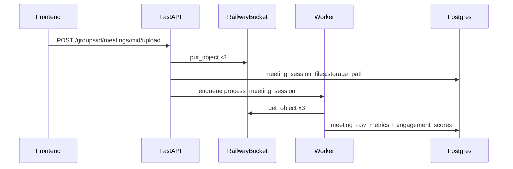

# CollabTrack — Backend Guide: Railway Object Storage for Meeting Files

This document describes how to integrate **Railway Object Storage** (S3-compatible buckets) with the CollabTrack FastAPI backend for persisting meeting upload files (attendance CSV, transcript TXT, chat TXT).

**Related docs:**
- [`docs/meeting-engagement-backend.md`](meeting-engagement-backend.md) — meeting API, DB schema, parsing, engagement scores
- [`service/meetings.service.ts`](../service/meetings.service.ts) — frontend multipart upload contract

**Backend repository:** [collabtrack_backend](https://github.com/yvettegahamanyi/collabtrack_backend)

---

## Overview

Meeting sessions require three uploaded files per session. The frontend sends them via multipart form upload; the backend must store them durably before background processing.

| Approach | Production-ready on Railway? |
|----------|------------------------------|
| Local container disk | No — files lost on redeploy/restart |
| Railway Object Storage (bucket) | Yes — S3-compatible, persistent |

The **frontend does not change**. Only the backend storage layer uses the bucket.

---

## Architecture



---

## Railway setup

### 1. Create a bucket

In your Railway project:

1. Add **Object Storage** / **Bucket** service
2. Copy these values from the bucket dashboard:
   - **Endpoint URL**
   - **Bucket Name**
   - **Access Key ID**
   - **Secret Access Key**

### 2. Configure backend environment variables

Add to your **backend service** on Railway (Variables tab). Do **not** add these to the frontend.

```env
S3_ENDPOINT_URL=https://your-railway-endpoint
S3_BUCKET_NAME=your-bucket-name
S3_ACCESS_KEY_ID=your-access-key-id
S3_SECRET_ACCESS_KEY=your-secret-access-key
S3_REGION=auto
S3_PREFIX=collabtrack
```

For local development, mirror the same values in backend `.env`. Never commit secrets to git.

| Variable | Description |
|----------|-------------|
| `S3_ENDPOINT_URL` | Railway-provided S3 endpoint (not `amazonaws.com` unless Railway specifies it) |
| `S3_BUCKET_NAME` | Target bucket name |
| `S3_ACCESS_KEY_ID` | Bucket access key |
| `S3_SECRET_ACCESS_KEY` | Bucket secret key |
| `S3_REGION` | Usually `auto`; use Railway dashboard value if uploads fail |
| `S3_PREFIX` | Optional root prefix for all object keys (e.g. `collabtrack`) |

---

## Python dependencies

Add to `requirements.txt`:

```
boto3
python-multipart
```

`python-multipart` is required for FastAPI `UploadFile` if not already installed.

---

## Suggested module layout

```
app/
  core/config.py          # S3_* settings from env
  services/storage.py     # S3 client, upload, download, delete
  routers/meetings.py     # upload route calls storage service
  tasks/meeting_tasks.py  # worker downloads files for parsing
```

---

## Configuration (Pydantic settings)

```python
# app/core/config.py
from pydantic_settings import BaseSettings


class Settings(BaseSettings):
    S3_ENDPOINT_URL: str
    S3_BUCKET_NAME: str
    S3_ACCESS_KEY_ID: str
    S3_SECRET_ACCESS_KEY: str
    S3_REGION: str = "auto"
    S3_PREFIX: str = "collabtrack"
    MEETING_FILE_MAX_BYTES: int = 52_428_800  # 50 MB

    class Config:
        env_file = ".env"


settings = Settings()
```

---

## Storage service

```python
# app/services/storage.py
from __future__ import annotations

import re
from uuid import UUID

import boto3
from botocore.client import Config
from fastapi import UploadFile

from app.core.config import settings


def get_s3_client():
    return boto3.client(
        "s3",
        endpoint_url=settings.S3_ENDPOINT_URL,
        aws_access_key_id=settings.S3_ACCESS_KEY_ID,
        aws_secret_access_key=settings.S3_SECRET_ACCESS_KEY,
        region_name=settings.S3_REGION,
        config=Config(signature_version="s3v4"),
    )


def _sanitize_filename(filename: str) -> str:
    name = filename.split("/")[-1].split("\\")[-1]
    return re.sub(r"[^A-Za-z0-9._-]", "_", name) or "upload"


def build_object_key(
    group_id: UUID,
    meeting_id: UUID,
    file_type: str,
    original_filename: str,
) -> str:
    safe_name = _sanitize_filename(original_filename)
    return (
        f"{settings.S3_PREFIX}/groups/{group_id}/meetings/{meeting_id}/"
        f"{file_type.lower()}-{safe_name}"
    )


async def upload_meeting_file(
    *,
    group_id: UUID,
    meeting_id: UUID,
    file_type: str,
    upload_file: UploadFile,
) -> str:
    contents = await upload_file.read()
    if len(contents) > settings.MEETING_FILE_MAX_BYTES:
        raise ValueError(
            f"{file_type} file exceeds max size of {settings.MEETING_FILE_MAX_BYTES} bytes"
        )

    key = build_object_key(
        group_id,
        meeting_id,
        file_type,
        upload_file.filename or "upload",
    )

    s3 = get_s3_client()
    s3.put_object(
        Bucket=settings.S3_BUCKET_NAME,
        Key=key,
        Body=contents,
        ContentType=upload_file.content_type or "application/octet-stream",
    )
    return key


def download_file(key: str) -> bytes:
    s3 = get_s3_client()
    response = s3.get_object(Bucket=settings.S3_BUCKET_NAME, Key=key)
    return response["Body"].read()


def delete_file(key: str) -> None:
    s3 = get_s3_client()
    s3.delete_object(Bucket=settings.S3_BUCKET_NAME, Key=key)


def delete_files(keys: list[str]) -> None:
    for key in keys:
        delete_file(key)
```

Store the returned **object key** in `meeting_session_files.storage_path` (see [`meeting-engagement-backend.md`](meeting-engagement-backend.md)).

### Object key convention

```
{S3_PREFIX}/groups/{group_id}/meetings/{meeting_id}/{file_type}-{original_filename}
```

Example:

```
collabtrack/groups/abc-123/meetings/def-456/attendance-team-session.csv
collabtrack/groups/abc-123/meetings/def-456/transcript-meeting.txt
collabtrack/groups/abc-123/meetings/def-456/chat-meeting.txt
```

---

## Upload endpoint integration

Wire into `POST /api/groups/{group_id}/meetings/{meeting_id}/upload`.

### Frontend multipart contract (must match exactly)

From `service/meetings.service.ts`:

| Form field | Expected type |
|------------|---------------|
| `attendance_file` | `.csv` |
| `transcript_file` | `.txt` |
| `chat_file` | `.txt` |

### Handler flow

```python
from fastapi import APIRouter, Depends, File, UploadFile
from uuid import UUID

router = APIRouter()


@router.post("/{group_id}/meetings/{meeting_id}/upload")
async def upload_meeting_files(
    group_id: UUID,
    meeting_id: UUID,
    attendance_file: UploadFile = File(...),
    transcript_file: UploadFile = File(...),
    chat_file: UploadFile = File(...),
    current_user=Depends(get_current_user),
):
    # 1. Authorize: group owner or instructor
    session = await get_meeting_session_or_404(group_id, meeting_id)
    await ensure_can_manage_group(group_id, current_user)

    # 2. Validate extensions
    _require_extension(attendance_file, {".csv"})
    _require_extension(transcript_file, {".txt"})
    _require_extension(chat_file, {".txt"})

    # 3. Upload to Railway bucket
    attendance_key = await upload_meeting_file(
        group_id=group_id,
        meeting_id=meeting_id,
        file_type="attendance",
        upload_file=attendance_file,
    )
    transcript_key = await upload_meeting_file(
        group_id=group_id,
        meeting_id=meeting_id,
        file_type="transcript",
        upload_file=transcript_file,
    )
    chat_key = await upload_meeting_file(
        group_id=group_id,
        meeting_id=meeting_id,
        file_type="chat",
        upload_file=chat_file,
    )

    # 4. Persist meeting_session_files rows
    await save_session_file(session.id, "ATTENDANCE", attendance_key, attendance_file.filename)
    await save_session_file(session.id, "TRANSCRIPT", transcript_key, transcript_file.filename)
    await save_session_file(session.id, "CHAT", chat_key, chat_file.filename)

    # 5. Update session status and enqueue worker
    await update_session_status(meeting_id, "UPLOADED")
    enqueue_process_meeting_session(meeting_id, group_id)

    updated = await get_meeting_session_out(meeting_id)
    return success(updated, "Files uploaded successfully.")
```

Response envelope:

```json
{
  "data": { "...MeetingSessionOut..." },
  "message": "Files uploaded successfully.",
  "code": 200
}
```

---

## Background worker integration

In `process_meeting_session(meeting_id, group_id)`:

```python
def process_meeting_session(meeting_id: str, group_id: str) -> None:
    files = get_session_files(meeting_id)  # rows from meeting_session_files

    attendance_bytes = download_file(files.attendance.storage_path)
    transcript_bytes = download_file(files.transcript.storage_path)
    chat_bytes = download_file(files.chat.storage_path)

    attendance_text = attendance_bytes.decode("utf-8")
    transcript_text = transcript_bytes.decode("utf-8")
    chat_text = chat_bytes.decode("utf-8")

    # parse, map names, store metrics, recalculate engagement...
```

Parse in memory — no temp files required on the container.

On `FAILED`, keep bucket objects for debugging. Optionally add a cleanup job for old failed sessions.

---

## Delete session cleanup

On `DELETE /api/groups/{group_id}/meetings/{meeting_id}`:

```python
files = await get_session_files(meeting_id)
keys = [f.storage_path for f in files]

delete_files(keys)
await delete_session_files_rows(meeting_id)
await delete_session_row(meeting_id)
await recalculate_group_engagement(group_id)
```

---

## Security checklist

- Bucket is **private** — only the backend service accesses it
- Do **not** return `storage_path` or bucket URLs in API responses
- Do **not** expose access keys to the frontend
- Validate JWT and group manage permissions before upload/delete
- Enforce file extension and size limits before `put_object`
- Rate-limit the upload endpoint
- Sanitize filenames before using them in object keys

---

## Troubleshooting

| Symptom | Likely cause | Fix |
|---------|--------------|-----|
| `403 Forbidden` on upload | Wrong credentials or insufficient bucket permissions | Regenerate keys; verify bucket policy |
| Signature / region errors | Wrong region or endpoint | Use Railway endpoint URL exactly; try `S3_REGION=auto` |
| `NoSuchBucket` | Wrong bucket name env var | Match Railway dashboard bucket name |
| Upload succeeds but worker can't read | Key mismatch in DB vs bucket | Log `storage_path` and verify in Railway bucket UI |
| Works locally, fails on Railway | Missing env vars on deployed service | Add all `S3_*` vars to backend Railway service |

---

## Manual test plan

### 1. Verify bucket connectivity (optional script)

```python
from app.services.storage import get_s3_client
from app.core.config import settings

s3 = get_s3_client()
s3.put_object(
    Bucket=settings.S3_BUCKET_NAME,
    Key=f"{settings.S3_PREFIX}/healthcheck.txt",
    Body=b"ok",
)
print("Bucket write OK")
```

### 2. Upload via API

```bash
curl -X POST "https://your-api/api/groups/{group_id}/meetings/{meeting_id}/upload" \
  -H "Authorization: Bearer YOUR_JWT" \
  -F "attendance_file=@attendance.csv" \
  -F "transcript_file=@transcript.txt" \
  -F "chat_file=@chat.txt"
```

### 3. Verify in Railway

- Open bucket file browser in Railway dashboard
- Confirm three objects under `collabtrack/groups/.../meetings/...`

### 4. Verify in database

- Three rows in `meeting_session_files` with correct `storage_path` keys
- Session status progresses: `UPLOADED` → `PROCESSING` → `COMPLETED`

### 5. Delete session

- Call `DELETE /groups/{id}/meetings/{id}`
- Confirm objects removed from bucket and DB rows deleted

---

## Implementation checklist

- [ ] Create Railway bucket and copy credentials
- [ ] Set `S3_*` env vars on backend Railway service
- [ ] Add `boto3` to `requirements.txt`
- [ ] Implement `app/services/storage.py`
- [ ] Wire upload route to storage service
- [ ] Worker reads files via `download_file(key)`
- [ ] Delete route removes bucket objects
- [ ] End-to-end test with frontend Meeting Sessions tab

---

## Frontend reference (unchanged)

The frontend upload flow:

1. `POST /groups/{id}/meetings` — create session
2. `POST /groups/{id}/meetings/{id}/upload` — multipart with three files
3. Poll `GET /groups/{id}/meetings/{id}` until `COMPLETED` or `NEEDS_MAPPING`
4. Refresh `GET /groups/{id}/engagement`

No frontend changes are required when switching from local disk to Railway buckets.
